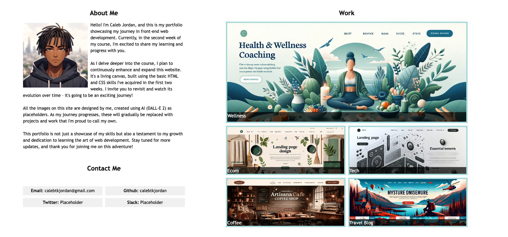

# Caleb Jordan's Portfolio Page

## Overview
Welcome to the repository for my personal portfolio page. This project is part of my journey through a front-end web development course, showcasing my growing skills in HTML and CSS. 

## Project Objectives
- Build a portfolio page to showcase skills and projects.
-  Ceate a responsive and visually appealing layout using the technologies and skills that I have learned up to this point.
- Update and expand the portfolio as the course progresses, adding real projects in place of initial placeholders.

## Deployment
The portfolio is deployed via GitHub Pages and can be viewed [here](https://calebtkjordan.github.io/css-portfolio-challenge/).

## Placeholder Images
All images currently used in the portfolio are designed by me, created using AI (DALL-E 2) as placeholders. As I develop real projects, these placeholders will be replaced with actual work samples.
